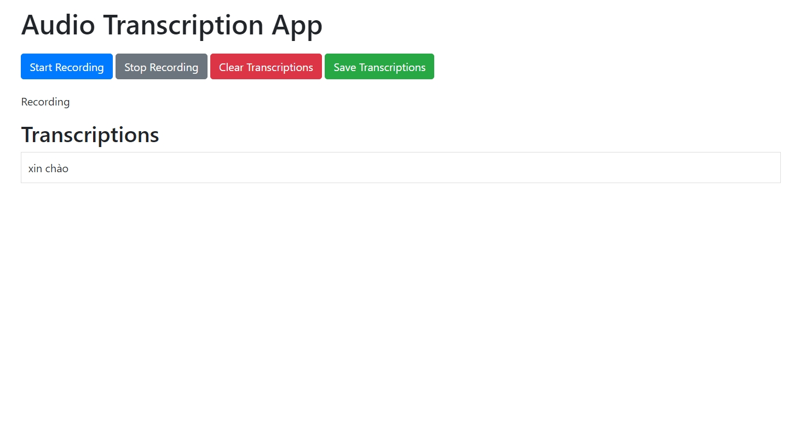

# Real time Transcribe

This project real time transcribe by record audio by mircro on backend device the text.



## Features

- Transcribe audio to text
- Real time transcribe for Vietnamese
- Real time transcribe for English

## Drawback

- It using the micro from backend so can not deploy using docker
- Model need more data to have higher accuracy
- Micro for record need clearly voice, if want have high accuracy

## Development
Because this is an experiment, so I using micro on backend, so I not using Docker to deploy, just using "conda" or "pipenv" to set up environment.

```sh
pip install -r requirements.txt
```

```sh
# on Ubuntu or Debian
sudo apt update && sudo apt install ffmpeg

# on Arch Linux
sudo pacman -S ffmpeg

# on MacOS using Homebrew (https://brew.sh/)
brew install ffmpeg

# on Windows using Chocolatey (https://chocolatey.org/)
choco install ffmpeg

# on Windows using Scoop (https://scoop.sh/)
scoop install ffmpeg
```

Run the Flask application:

```sh
uvicorn app:app --reload
```

Open your web browser and go to http://localhost:5000.

## Usage
- Open your web browser and go to http://localhost:5000.
- Enter the YouTube link of the video you want to translate.
- Select the translation direction (Vietnamese to English or English to Vietnamese).
- Submit the form and wait for the processing to complete.
- The translated video with subtitles will be available for download.

## Note
- First time you using it will download model from hugging face so you need to wait

## Project Structure
- fine_tune_whisper: The notebook for fine tune whisper model.
- app.py: The main Flask application.
- audio_recorder.py: Module for record audio by backend device.
- post_processing.py: Module for post process the result by model.
- config.py: Configuration file containing model names and device settings.
- requirements.txt: Python dependencies.

## Configuration
The configuration settings, including model names and device settings, are located in config.py.

## Dependencies
- Python 3.9
- Fastapi
- fastapi_socketio
- Faster-whisper
- uvicorn
- eventlet
- torch
- pyaudio
- pydub

## License
This project is licensed under the MIT License. See the LICENSE file for details.

## Acknowledgmentss
- Whisper for transcription
- Faster - whisper for quantize model faster x4 for normal whisper
- Algorithm for pre process audio.